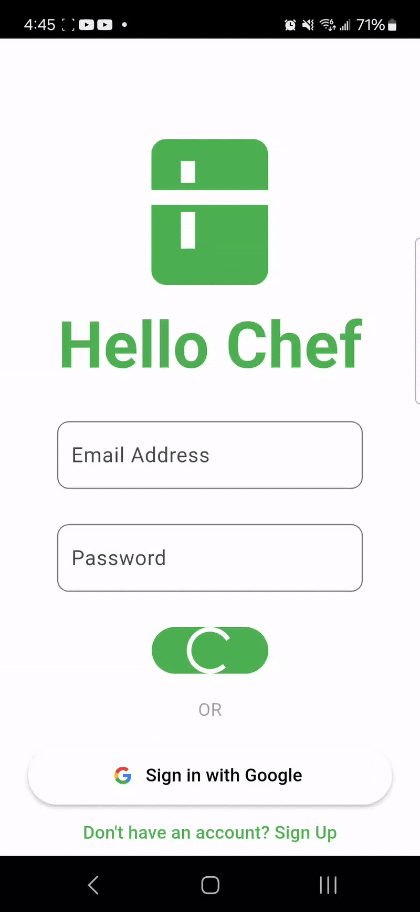
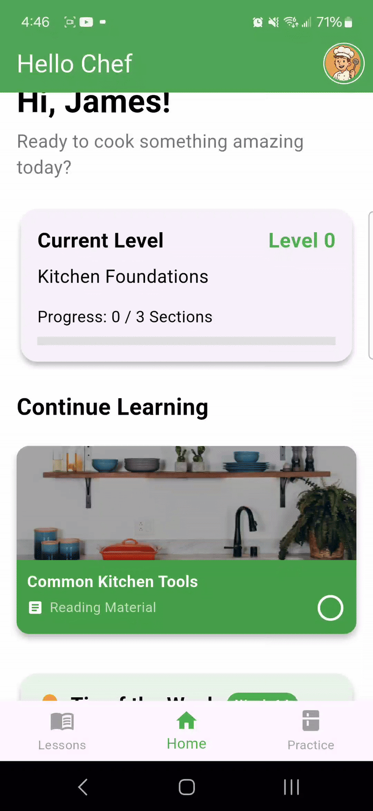
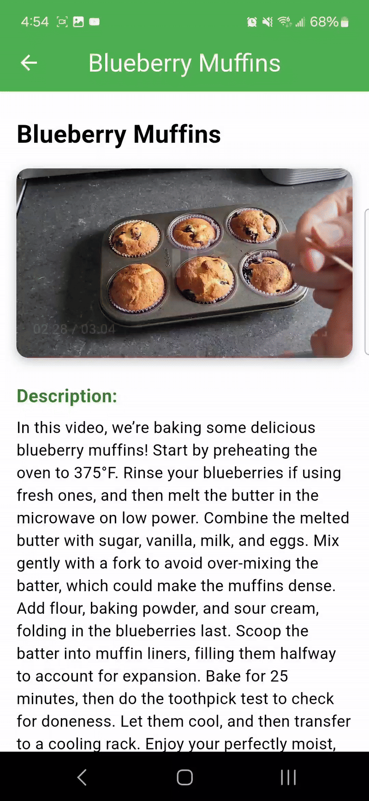
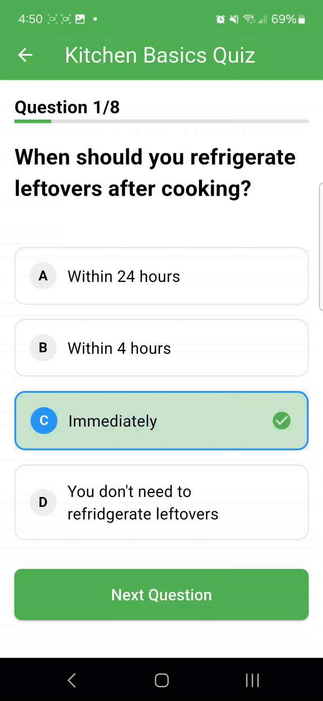
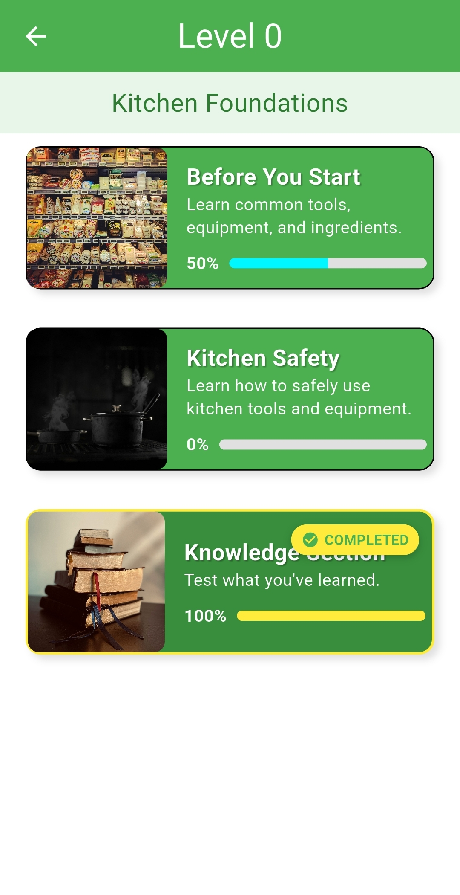
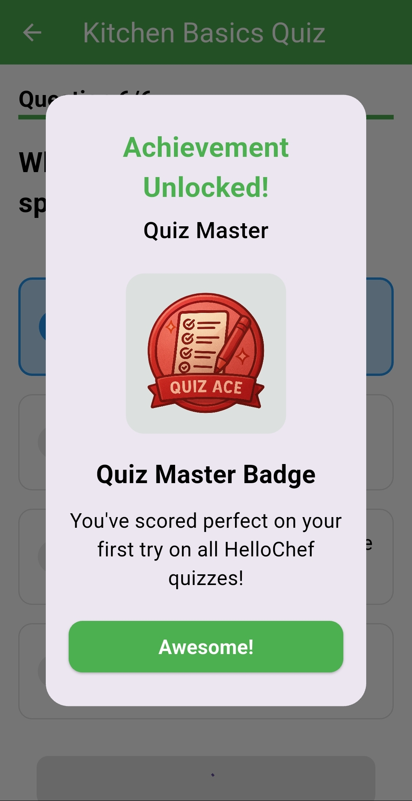
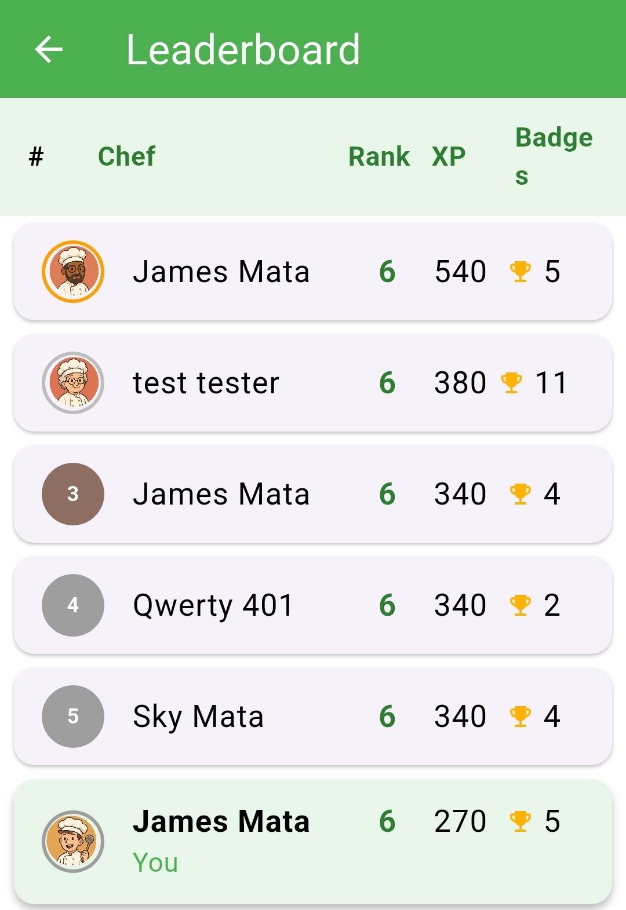

# 🍳 HelloChef – Learn to Cook with Confidence

Welcome to **HelloChef**, a beginner-friendly mobile app designed to teach essential cooking skills through interactive lessons, video guides, practice simulations, and gamified learning! Built with Flutter as part of a CSCI 4080 project.

---

## 📲 Getting Started

### 🔐 Login & Onboarding
HelloChef starts by allowing users to securely log in and create a personalized profile.

 <!-- Replace with actual login screen GIF -->

---

## 🧭 Navigation Overview

Explore a clean and intuitive interface with tabs for:
- **Lessons**
- **Practice Recipes**
- **Quizzes**
- **Profile**
- **Leaderboard**

 <!-- Replace with navigation GIF -->

---

## 🎥 Watch Step-by-Step Cooking Videos

Each lesson includes a narrated walkthrough video to guide you through foundational skills.

 <!-- Replace with video tutorial GIF -->

---

## 🧠 Complete Quizzes

Test your knowledge with interactive quizzes. Receive **instant feedback** to reinforce learning.

 <!-- Replace with quiz screen GIF -->

---

## 🖼️ Interact with Infographics

Explore interactive diagrams and images to better understand cooking techniques and safety.

 <!-- Replace with image interaction demo -->

---

## 📈 Track Your Progress

Stay on top of your cooking journey with built-in progress tracking:

- Resume where you left off
- View completed lessons and quizzes
- Monitor badge and XP growth

 <!-- Replace with progress tracking demo -->

---

## 🏅 Gamification & Motivation

Stay engaged through gamified learning:

### 🧪 Gain XP & Rank Up
Earn experience points as you complete lessons and challenges.

 <!-- Replace with XP gain demo -->

### 🎖️ Earn Badges
Unlock badges as you hit milestones and improve your skills.

 <!-- Replace with badges demo -->

### 🏆 Compete on the Leaderboard
See how you stack up against other users as you level up your cooking skills.

 <!-- Replace with leaderboard demo -->

---

## 📖 Explore & Read Recipes

Access a curated selection of beginner-friendly recipes with step-by-step breakdowns and practice simulations.

 <!-- Replace with recipe screen -->

---

## 🧑‍🎨 Customize Your Profile

Choose your own profile picture from the app gallery and showcase your cooking journey.

 <!-- Replace with pfp customization demo -->

---

## 🌙 Dark Mode Support

Prefer a darker interface? HelloChef supports full dark mode for late-night cooking sessions.

 <!-- Replace with dark mode toggle demo -->

---

## 📦 Built With

- [Flutter](https://flutter.dev/) – Cross-platform framework
- [Dart](https://dart.dev/) – Programming language used with Flutter
- [Figma](https://figma.com/) – UI/UX design mockups
- [Supabase](https://supabase.com/) – for authentication and database 

---

## 🚧 Future Plans

- Text-to-speech instructions
- Support for multiple languages
- Advanced recipe packs and simulations
- Competitive cooking events

---

## 🤝 Authors

Created by:
- Harish Kirubaharan  
- James Mata  
- Harsh Panchal

For **CSCI 4080 Final Project** – April 2025

---

## 📷 Media Assets

All screenshots, GIFs, and media demos go inside the `assets/` folder.  
Use `.gif` format where possible to demonstrate interactions.

---

## 📜 License

[MIT License](LICENSE) – Free to use and modify.
